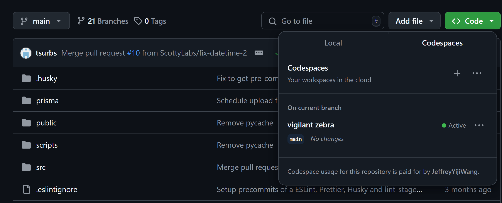

# CMU Maps

## Getting Started

0. Get added to the CMU Maps team repository.
1. Create a Github Codespace by clicking on the code button on the CMU Maps Repo and clicking the Codespaces tab. See image below:

2. Click on the plus button to create a GitHub code space that will appear in another tab
 

3. Run this command **GITHUB_TOKEN=$GH_TOKEN** in the terminal

4. Run this command **git submodule update --init --recursive** in the terminal

5. Run this command **npm run dev** in the terminal after this text pops up

6. If you see this error pop up, follow step 7 else skip to step 8.

7. Run this command **nvm install node** in the terminal and then rerun **npm run dev** in the terminal after it finishes downloading all the packages.

8. If you see that the program is running like below, you are set up unless you want to work in vscode then follow step 9.

9. Go back to the CMU Maps GitHub Repo and click on the code button, Codespaces tab, and find your code space.

10. Click on the three dots "**. . .**" and click from the dropdown options "**Open in Visual Studio Code**"

11. Accept all the pop ups for nessecary installation. 

## Sending a PR(Pull Request)

1. Create 

2.  Click on the three dots "**. . .**" and click from the dropdown options "**Export Changes to a branch**"

